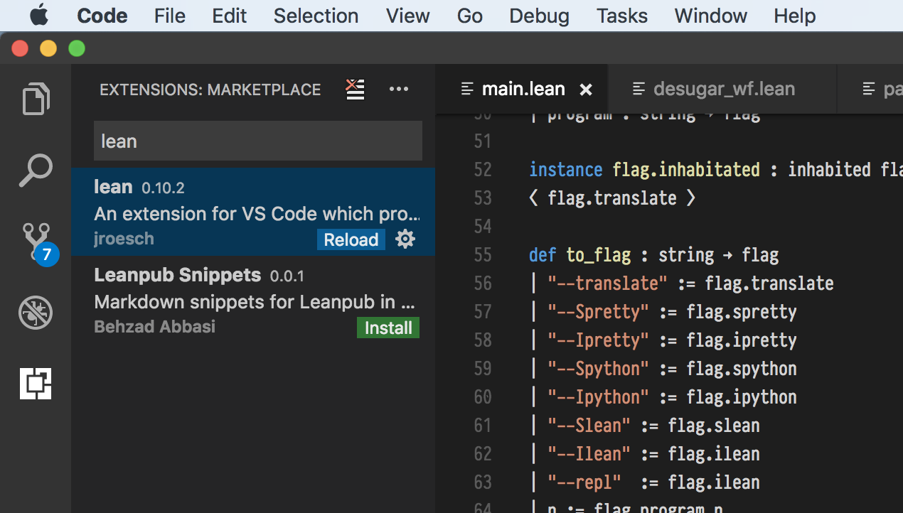

# Lean Up

This tool is intended to help students install & update Lean for CSE 505.

This is the first version of the class we are offering written in Lean,
and the goal of this tool is to make upgrade as seamless as possible for
you over the course of the quarter.

_Note: This is the first iteration of the course with Lean, and this auto-updating software is
a work in progress, if you find issues please report them to us so we can try to improve the
user experince._

### Setup
Getting set _up_ with _Lean_ takes just a few simple steps.

In order to run `leanup.py` you need a few components:

- [Git](https://git-scm.com/)
- Python 3 (with `pip`), it should be installed on most Linux distributions,
  can easily be installed on macOS with [homebrew](https://brew.sh/), and Windows instructions
  are [here](docs/windows_setup.md).
- [VSCode](https://code.visualstudio.com/)
- [GMP](https://gmplib.org/) (should be installed on MSYS2 or Linux, can be installed with Homebrew)

First clone this tool on to your computer:
```bash
git clone https://github.com/uwplse/leanup
```

Then setup the tool (you should only do this once: *please substitute `3.XX` for your Python 3 version*).

```bash
pip install pipenv
cd leanup
pipenv --python 3.XX install
pipenv shell
```

You should now be able to run:

```
./leanup.py install
```

Next install the [Lean
mode](https://marketplace.visualstudio.com/items?itemName=jroesch.lean) for
VSCode.  When you click on the green "Install" button on that page, it
should open VSCode and install the plugin.


Now copy the path provided to you by the tool since we will need it for VSCode.

First we need to install the Lean Extension for VSCode, open the command palette (`cmd-shift-p` or `ctrl-shift-p`) and select `Extensions: Install Extensions`.

You should be presented with a panel in the gutter, where you can type Lean, and click install.


After installing the extension you should see the Lean extension listed as in the below image, with the
reload button in blue.



Now open `User Settings` window of VSCode (`cmd-,` or `ctrl-,` depending on platform),
and modify the `lean.executablePath` to point to the executable provided by `leanup`.


When you are all done you should be able to open the file in `test/example.lean` and see some diagnostics.


Overall this process should take no more then a few minutes. I've done my best to test it on the major
platforms, if you have trouble please drop by the Slack channel `#505-au17` for questions/help.

### Use

`leanup.py` has a one feature right now updating the Lean executables used by the class you can use `./leanup install`
to fetch a version, and `./leanup sync` to pull the latest version of the executable.
